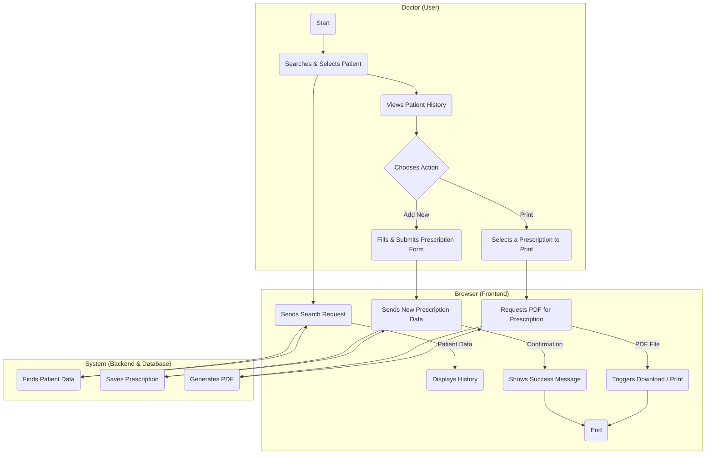

```mermaid

graph TD
    subgraph "Doctor (User)"
        A1(Start) --> A2(Searches & Selects Patient);
        A2 --> A3(Views Patient History);
        A3 --> A4{"Chooses Action"};
        A4 -- Add New --> A5(Fills & Submits Prescription Form);
        A4 -- Print --> A6(Selects a Prescription to Print);
    end

    subgraph "Browser (Frontend)"
        A2 --> B1(Sends Search Request);
        B1 -- Patient Data --> B2(Displays History);
        A5 --> B3(Sends New Prescription Data);
        B3 -- Confirmation --> B4(Shows Success Message);
        B4 --> Z(End);
        A6 --> B5(Requests PDF for Prescription);
        B5 -- PDF File --> B6(Triggers Download / Print);
        B6 --> Z(End);
    end

    subgraph "System (Backend & Database)"
        B1 --> C1(Finds Patient Data);
        C1 --> B1;
        B3 --> C2(Saves Prescription);
        C2 --> B3;
        B5 --> C3(Generates PDF);
        C3 --> B5;
    end
```